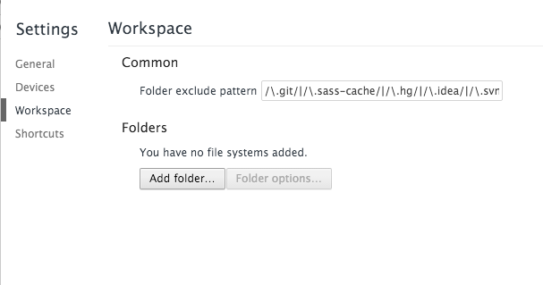
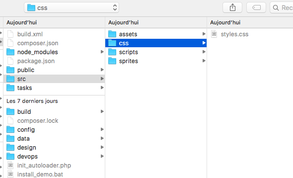
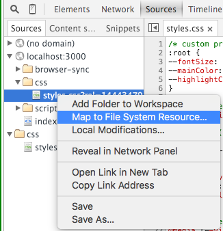

# quickburger

## Tasks

- build css (postcss, nanocss, cssnext)
- babeljs
- browser-sync OR serve/livereload
- sprite (spritesmith)
- imagemin
- watch

## Dependencies

- Node

## Install

```shell
npm install
```

## Npm task

```json
"scripts": {
  "serve": "node tasks/serve.js ./public 8000",
  "sync": "./node_modules/.bin/browser-sync start --port 8000 --server public --files \"public/css/styles.css, public/scripts/bundle.js, public/*.html\"",
  "build:css": "node tasks/css.js ./src/css/styles.css ./public/css/styles.css",
  "build:js": "node tasks/babel.js ./src/scripts/scripts.js ./public/scripts/bundle.js",
  "build:sprites": "node tasks/sprite.js /src/sprites/ /src/assets/images/sprites.png alt-diagonal",
  "build:images": "node tasks/image.js ./src/assets/images/ ./public/assets/images/",
  "build": "./node_modules/.bin/parallelshell 'npm run build:css' 'npm run build:js' 'npm run build:sprites' 'npm run build:images'",
  "build:production": "NODE_ENV=prod npm run build",
  "livereload": "./node_modules/.bin/live-reload --port 9091 public/",
  "watch:css": "./node_modules/.bin/watch 'npm run build:css' ./src/css/",
  "watch:js": "./node_modules/.bin/watch 'npm run build:js' ./src/scripts/",
  "watch:sprites": "./node_modules/.bin/watch 'npm run build:sprites' ./src/sprites/",
  "watch:images": "./node_modules/.bin/watch 'npm run build:images' ./src/assets/images/",
  "watch:dev:serve": "./node_modules/.bin/parallelshell 'npm run serve' 'npm run watch:css' 'npm run watch:js' 'npm run watch:sprites' 'npm run watch:images' 'npm run livereload'",
  "watch:dev:sync": "./node_modules/.bin/parallelshell 'npm run sync' 'npm run watch:css' 'npm run watch:js' 'npm run watch:sprites' 'npm run watch:images'"
},
```

###Standalone tasks

- build: 
	- css (**input:** <mark>./src/css/styles.css</mark> => **output:** <mark>./public/css/styles.css</mark>)
	- js - es2015 (**input:** <mark>./src/scripts/scripts.js</mark> => **output:** <mark>./public/scripts/bundle.js</mark>)
	- sprites (**input:** <mark>/src/sprites/</mark> => **output:** <mark>/src/assets/images/sprites.png</mark>, **sprite algo:** top-down OR left-right OR diagonal OR alt-diagonal OR binary-tree)
	- images optimizer (**input:** <mark>./src/assets/images/</mark> => **output:** <mark>./public/assets/images/</mark>)

- serve: run simple server (**folder:** <mark>./path/to/folder/</mark>, **port:** port)
- livereload: run simple server (folder: <mark>./path/to/folder/</mark>, --port: port)

- sync: run browser-sync server (**port:** port, **folder:** <mark>./path/to/folder/</mark>, **port:** port)
  - --port (port)
	- --server public (folder to watch)
	- --files \"public/css/styles.css, public/scripts/bundle.js, public/*.html\" file to reload when changing

Never use server+livereload at the same time with sync (almost the same)

###Watch tasks

- css
- js
- sprites
- image

###Super tasks

- build (parallel run multitask for build only)
- build:production (parallel run multitask for build only, with production variable)
- watch:dev:serve (parallel run all watch tasks + livereload + serve)
- watch:dev:sync (parallel run all watch sync + serve)

## sources map

How to use sources maps

Open chrome dev tool



Import folder into workspace



Map system files to browser file


